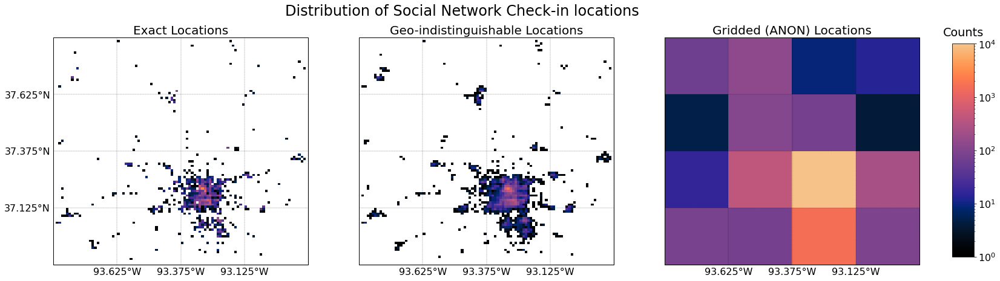

# spo_anon

### Overview
Crowdsourced mobile location data, from two publicly accessible datasets, are anonymized following the methodology (Section 3) of McNicholas and Mass (2021a).
Specifically, location data is first obfuscated, under the notion of geo-indistinguishability ([Andres et al., 2013](https://doi.org/10.1145/2508859.2516735); [Bordenabe, 2014](https://doi.org/10.1145/2660267.2660345)), and then generalized ([Krumm, 2007](https://doi.org/10.1145/2508859.2516735)) within the framework of k-anonymity ([Samarati and Sweeny, 1998](https://epic.org/privacy/reidentification/Samarati_Sweeney_paper.pdf)). This combined approach to the anonymization of location data is similar to that of [Kraemer et al. (2020)](https://doi.org/10.1038/s41562-020-0875-0) who combined differential privacy ([Dwork, 2006](https://doi.org/10.1007/11787006_1)) with k-anonymity to anonymize mobility traces.

In this demonstration geo-indistinguishability is used to augment the privacy protections of k-anonymity which does not consider adversaries prior knowledge and is vulnerable to probablistic attacks ([Fung et al., 2010](https://doi.org/10.1145/1749603.1749605)). By obfuscating SPO locations (geo-indistinguishability) prior to generalization (k-anonymity) we reduce the efficacy of probabilistic attacks by preventing an adversary from truly knowing whether an SPO belongs within a given anonymous grid box. As outlined in the McNicholas and Mass (2021a), after obfuscation a small fraction of SPOs are assigned a different ANON grid point then they would have been had they not been obfuscated. 

### Setup
To run the jupyter notebooks provided in this repository ensure you can use [conda](https://docs.conda.io/en/latest/). This repository contains an environment.yml file which can be used to automaticaly install all necessary python packages to run the example notebooks. This can be accomplished by running *"conda env create -f environment.yml"*. After the conda environment has been created you can activate it with *"conda activate spo_env"*. Once the environment is activated you can open jupyter and run the example notebooks.

#### [Example Notebooks](https://nbviewer.jupyter.org/github/cmac994/spo_anon/tree/master/example_notebooks/)

- [*Anonymization of Point Location Data*](https://nbviewer.jupyter.org/github/cmac994/spo_anon/blob/master/example_notebooks/SPO_Anonymization_Point_Data.ipynb)
   - This notebook provides a walkthrough of the anonymization methodology outlined in section 3 of McNicholas and Mass (2021a) using the publicly accessible geowalla and
   brightkite datasets ([Cho et al., 2011](https://cs.stanford.edu/people/jure/pubs/mobile-kdd11.pdf)) which contain the location of “check-ins” left by users of the social 
   networks of the same name.

- [*Anonymization of Mobile Location Data*](https://nbviewer.jupyter.org/github/cmac994/spo_anon/blob/master/example_notebooks/SPO_Anonymization_Mobile_Data.ipynb)
   - This notebook provides a walkthrough of the anonymization methodology outlined in section 3 of McNicholas and Mass (2021a) using the publicly accessible T-Drive dataset     
   ([Yuan et al., 2010](https://doi.org/10.1145/1869790.1869807)) from Microsoft Research, which contains GPS traces of taxicabs in Beijing. 
   
*Notebooks Outline*
  - Plot distribution of crowdsourced location data
  - Anonymize location data by combining Geo-Indistinguishability ([Andres et al., 2013](https://doi.org/10.1145/2508859.2516735)) and K-Anonymity ([Samarati and Sweeny, 1998](https://epic.org/privacy/reidentification/Samarati_Sweeney_paper.pdf))
  - Display location data at each stage of anonymization (similar to Fig. 3; McNicholas and Mass, 2021a)
  - Show the distribution of pressure errors drawn from a sample of real IBM SPO errors
  - Create synthetic pressure observations at crowdsourced locations to simulate a network of SPOs. 
  - Assign pressure errors to synthetic pressure observations using a random sample of real IBM SPO errors
  - Show data in table format to highlight how the location and pressure data would look before and after anonymization
  - Display synthetic pressure observations, at each stage of anonymization.
  - Show the distribution of pressure observations errors, at each stage of anonymization, and plot the results on a map.

#### References:

Andrés, M. E., N. E. Bordenabe, K. Chatzikokolakis, and C. Palamidessi. 2013. Geo-indistinguishability: differential privacy for location-based systems. Proceedings of the 2013 ACM SIGSAC conference on Computer & communications security (CCS '13). Association for Computing Machinery, New York, NY, USA, pp. 901–914. https://doi.org/10.1145/2508859.2516735

Cho E., Myers S.A., Leskovec J., 2011: Friendship and Mobility: Friendship and Mobility: User Movement in Location-Based Social Networks. *ACM SIGKDD International Conference on Knowledge Discovery and Data Mining (KDD)*. https://cs.stanford.edu/people/jure/pubs/mobile-kdd11.pdf

Bordenabe, N. E., K. Chatzikokolakis, and C. Palamidessi. 2014. Optimal geo-indistinguishable mechanisms for location privacy. *Proceedings of the 2014 ACM SIGSAC Conference on Computer and Communications Security (CCS '14). Association for Computing Machinery*, New York, NY, USA, 251–262. https://doi.org/10.1145/2660267.2660345

Dwork C. (2006) Differential Privacy. In: Bugliesi M., Preneel B., Sassone V., Wegener I. (eds) *Automata, Languages and Programming. ICALP 2006. Lecture Notes in Computer Science*, vol 4052. Springer, Berlin, Heidelberg. https://doi.org/10.1007/11787006_1

Fung B. C. M., Wang K., Chen R., Yu P.S., 2010: Privacy-preserving data publishing: A survey of recent developments. ACM Comput. Surv. 42, 4, Article 14 (June 2010), 53 pages. DOI:https://doi.org/10.1145/1749603.1749605

Kraemer, M.U.G., and Coauthors, 2020: Mapping global variation in human mobility. Nat Hum Behav 4, 800–810. https://doi.org/10.1038/s41562-020-0875-0

Krumm, J., 2007: Inference attacks on location tracks. Proceedings of the 5th international conference on Pervasive computing (PERVASIVE'07). Springer-Verlag, Berlin, Heidelberg, pp. 127–143. https://doi.org/10.1145/2508859.2516735

McNicholas, C., C. Mass, 2021a: Bias Correction, Anonymization, and Analysis of Smartphone Pressure Observations with Machine Learning and Multi-Resolution Kriging. *Journal of Weather and Forecasting*, (in review).

Samarati P., and L. Sweeny, 1998: Protecting privacy when disclosing information: k-anonymity and its enforcement through generalization and suppression. *Tech Report SRI-CSL-98-04, SRI Computer Science Laboratory*, pp 19. https://epic.org/privacy/reidentification/Samarati_Sweeney_paper.pdf

Yuan J., Zheng Y., Zhang C., Xie W., Xie X., Sun G., and Huang Y. (2010): T-drive: driving directions based on taxi trajectories. *In Proceedings of the 18th SIGSPATIAL International Conference on Advances in Geographic Information Systems, GIS '10*, pages 99-108, New York, NY, USA,2010. ACM. https://doi.org/10.1145/1869790.1869807
